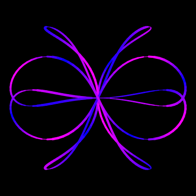

# LogoScript

TL;DR: [Demo][demo]

[demo]: http://pyrocat101.github.io/LogoScript/

LogoScript is a dialect of Logo programming language with ECMAScript-like syntax.
[Logo][logo] is an educational language designed by Seymour Papert and Wally Feurzeig that has its root in LISP.

[logo]: http://en.wikipedia.org/wiki/Logo_(programming_language)

Please check out my [post][blog-post] for an overview (in Chinese). Also take a look at code snippets in `examples/`.

# Showcase

The following code:

``` javascript
function getColor(theta) {
  return round(abs(255 * cos(theta)));
}

function width(angle, radius) {
  seth2(radius * sin(angle), radius * cos(angle));
  return 2 * (1.5 + sin(45 + 2 * geth()));
}

function spiral(angle, twist) {
  // Twisted Rose Curves
  radius = 180 * sin(4 * angle);
  angle = angle + 20 * sin(twist * angle);
  setpw(width(angle, radius));
  setpc('rgb(' + getColor(30 + 3 * angle) + ',0,255)');
  setxy(radius * sin(angle), radius * cos(angle));
  pd();
}

clear('black');
pu();

for (angle = 0; angle < 360; angle++) {
  spiral(angle, 7);
}
```

Produces the following image:



# Features

LogoScript is designed to be uber simple. However, it supports functions, recursion and a number of control structures. The built-in data type of LogoScript does not include array and dictionary due to the simplicity of implementation. Yet you can still draw fancy images without limit of the language.

# Implementation

The most part of LogoScript source code is written in CoffeeScript and is compiled into JavaScript(node.js). Note that it is only a toy language compiler, so I have barely applied any optimizations.

A parser is generated using peg.js to translate source code into AST (Abstract syntax tree), upon which two passes are adapted to convert AST into bytecode. Without complicated data type manipulation and closure support, the number of opcodes are less than 50.

The LogoScript bytecode runs on a stack-based virtual machine, where the expressions are evaluated. By calling built-in functions, which are backed up by cairo library, our scripting language can draw image and output it into a file.


[blog-post]: http://pyroc.at/blog/2012/05/19/introducing-logoscript/
